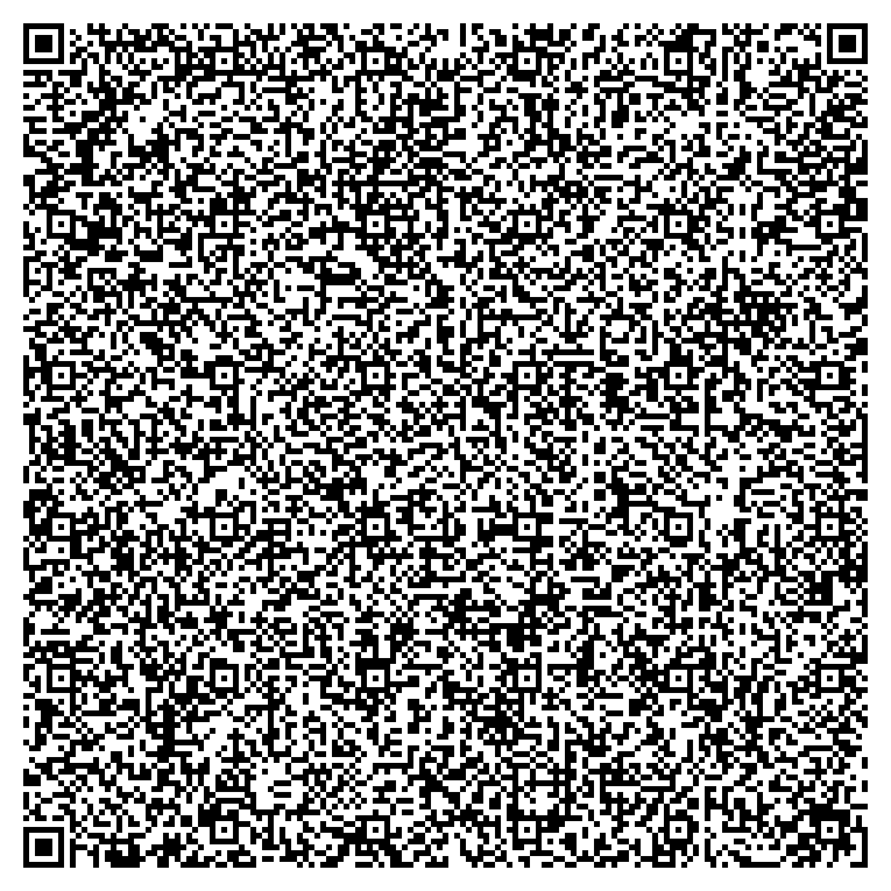

# ASMBadApple
## **5 8x8 frames of bad apple stuffed into 1.6kb of elf64, all available at the scan of this qr code:**

> ## Usage:
> - Linux: `./binfromqr`(either use the copy i gave you, or use any qr code reader thats willing to turn my qr code into a file)
> - Other platforms: switch to linux

> ## Test:
> - `python3 qrcodegenerator.py` to generate the qr code from the `badappletiny` binary.
> - `python3 qrcodereader.py` to generate the binary `binfromqr` from the qr code.
> - Scanning and downloading may work with some devices on some browsers, no guarantees.

Copyright (c) 2025, Aiden Bohlander, made with :3